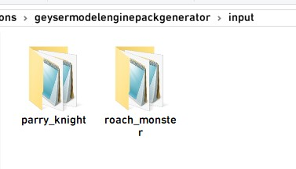

# GeyserModelEngine 自定义实体分支

> GitHub仓库：[https://github.com/zimzaza4/GeyserModelEngine/tree/custom-entity](https://github.com/zimzaza4/GeyserModelEngine/tree/custom-entity)

---

🌏 Language
[[English](README_EN.md)] [[简体中文](README.md)] [欢迎贡献更多语言]

---

# 这个跟主分支有什么区别?

这是个针对[zimzaza4的Geyser自定义实体分支](https://github.com/zimzaza4/Geyser)做的版本，同样支持MEG4但是不支持原版Geyser❌

跟主分支不同的是，这个是真正的自定义实体!!!🎉🎉🎉

而主分支是给BE生成个史蒂夫发送4d皮肤给be玩家，支持原版Geyser

只需要往资源包里塞动画文件即可，可以有效防止那些进服下个资源包就跑白嫖你模型的贼，但同时限制也挺多😥

总之两者各有各优势，根据各服务器情况选择

---

# 如何安装

根据服务端版本下载以下插件

| 插件                           | 链接                                                                 | 作用                            |
| :---                           | :----                                                                | :---                            |
| GeyserUtils                    | [Github](https://github.com/zimzaza4/GeyserUtils)                    | 让你的Geyser支持调用一些BE的东西  |
| GeyserModelEngine              | [Github](https://github.com/zimzaza4/GeyserModelEngine)              | 你猜                            |
| Geyser 自定义实体分支           | [Github](https://github.com/zimzaza4/Geyser)                         | 让Geyser支持自定义实体            |
| GeyserModelEnginePackGenerator | [Github](https://github.com/zimzaza4/GeyserModelEnginePackGenerator) | 帮你自动转换模型生成资源包        |

下载完后，将`GeyserModelEngine` `Geyser自定义实体分支`放入插件文件夹

根据服务端版本把`geyserutils-spigot`/`velocity`/`bungeecord`放入插件文件夹

`GeyserModelEnginePackGenerator` `geyserutils-geyser`放入geyser的扩展文件夹

先启动服务器生成相关配置文件，之后关闭服务器就安装好了

当然，先别急着用，现在你还得接着读下去

---

# 转换模型📦

现在`GeyserModelEnginePackGenerator`长大了学会自己转换模型生成资源包了

我们来到以下路径 `plugins/Geyser-Spigot/extensions/geysermodelenginepackgenerator/input/`

在此目录创建一个文件夹名为模型的ID，比如我有个模型id为`parry_knight`，那就命名为`parry_knight`

> 每个模型都要有独立的模型文件夹

我们将模型、动画和纹理全部原封不动丢进这个文件夹

重启服务器或者重载geyser让他开始生成资源包

来到`plugins/Geyser-Spigot/extensions/geysermodelenginepackgenerator`目录

这里你会看见多了个`generated_pack.zip`，那就说明打包好了

最后一步，重载Geyser或者重启服务器加载资源包

现在可以用基岩版进服下载资源包看看是否正常生效了

---

# 注意事项❗

* `geysermodelenginepackgenerator`是检测模型的数量有变更才会执行转换打包指令，想重新生成资源包建议先删掉`generated_pack.zip`然后重启服务器重新生成资源包。记得改uuid或版本号!!!
* 在新版本中不用把这个包丢进`geyser/packs`目录，他会自己加载上

---

# 完结🤗

恭喜你现在学会如何使用了😎有BUG或建议请发Issues

---

# 当前限制💢

* 不支持多纹理
* 头部旋转跟JE不太同步
* 待挖掘

---

# 常见问题❓

### 召唤模型后召唤的并非模型而是史蒂夫?

如果你确定你根据上面的教程一步一步做了，可能是这个模型的问题?
