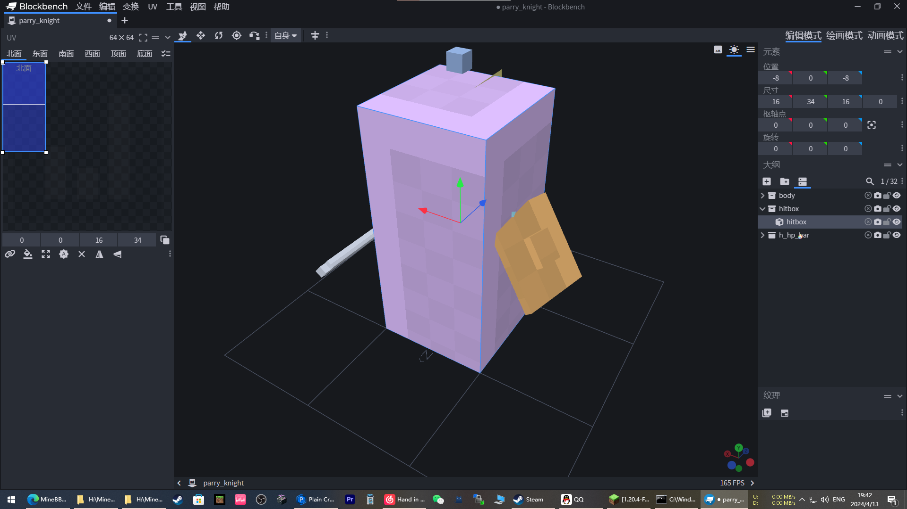
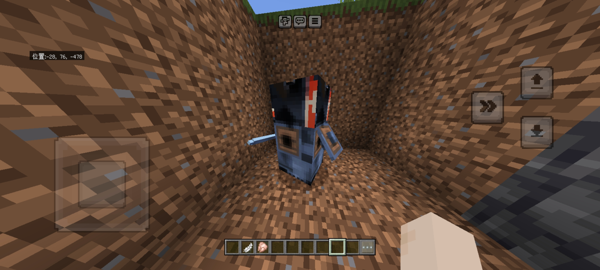
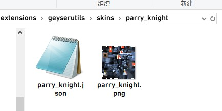
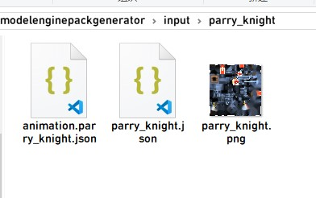

# GeyserModelEngine

> GitHub仓库：https://github.com/zimzaza4/GeyserModelEngine

# 这是个什么玩意

能让你Geyser服务器支持MEG4

# 如何安装

根据服务端版本下载以下插件

[GeyserUtils](https://github.com/zimzaza4/GeyserUtils)

[GeyserModelEngine](https://github.com/zimzaza4/GeyserModelEngine)

[LibsDisguises](https://www.spigotmc.org/resources/libs-disguises-free.81/)

下载完后，将GeyserModelEngine放入插件文件夹

把geyserutils-spigot/velocity/bungeecord放入插件文件夹

将geyserutils-geyser放入geyser的扩展文件夹，这时就安装好了

当然，先别急着用，现在你还得接着读下去

# 转换模型

打开你的bbmodel模型文件，将模型转换为基岩版模型

打开刚转换完的模型，把这个多余的hitbox删了

不然基岩版看会变成这样

然后记得保存模型纹理

# 安装模型

打开Geyser的`extensions`文件夹创建一个文件夹名为`geyserutils`，接着再往里创建一个文件夹名为`skins`

这时我们再创建一个文件夹名为你模型的id。比如我使用的测试模型的id是`parry_knight`，就创建`parry_knight`文件夹

最后将模型和纹理贴图放进去

这时候重启服务器你的BE玩家应该能正常看到模型了。

接下来就是有关模型动画的部分了!

# 模型动画

将模型的动画导出json格式

将动画文件名称修改为"animation.模型ID.json"

之后放入你的资源包

现在我们打开动画文件开始修改动画文件里的动画id

原本所有的动作id基本都是idle、walk这样的，现在你得给他加个前缀

例如：idle

改为：animation.模型ID.idle

示例：animation.parry_knight.idle

改完后修改资源包版本号或者uuid，打包资源包

重载Geyser或者重启服务器

# 完结

恭喜你现在学会如何使用了，如果还不会V我五毛帮你解决

# 当前限制

用了就知道, 一堆

# 常见问题

同上
